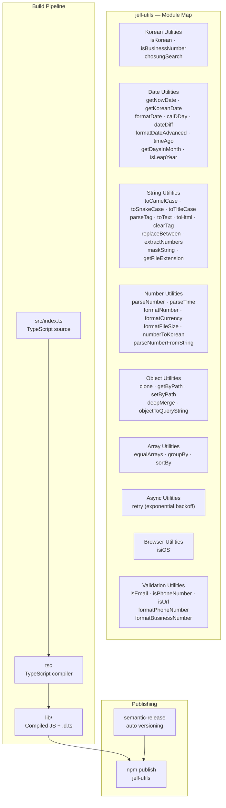
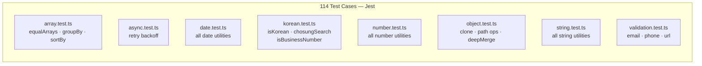

# jell-utils

> 한국어 특화 TypeScript 유틸리티 라이브러리
> Korean-specialized TypeScript utility library — date, number, string, validation, and more

[](https://npmjs.org/package/jell-utils)
[](https://npmjs.org/package/jell-utils)
[](https://nodejs.org/en/download/)
[](https://github.com/jellive/jell-utils.js/actions/workflows/ci.yml)
[](https://github.com/jellive/jell-utils.js)
[](https://github.com/jellive/jell-utils.js/blob/master/LICENSE)
[](https://www.typescriptlang.org)
[](https://bundlephobia.com/package/jell-utils)

---

## Architecture



### Test Coverage Map



---

## Install

```bash
npm install jell-utils
# or
yarn add jell-utils
```

---

## Quick Start

```typescript
import util from 'jell-utils'

// Korean string check
util.isKorean('안녕하세요')          // true
util.chosungSearch('김철수', 'ㄱㅊㅅ') // true

// Date formatting
util.getKoreanDate(new Date(), true)  // "2025년 03월 16일"
util.timeAgo(new Date(Date.now() - 3600000)) // "1시간 전"

// Number formatting
util.formatNumber(1234567)            // "1,234,567"
util.formatCurrency(50000)            // "50,000원"
util.numberToKorean(12345)            // "만이천삼백사십오"

// Validation
util.isPhoneNumber('010-1234-5678')   // true
util.isEmail('test@example.com')      // true
```

---

## API Reference

### Korean Utilities (한국어 유틸리티)

#### `isKorean(message: string): boolean`

문자열에 한국어가 포함되어 있는지 확인합니다.

```typescript
util.isKorean('안녕하세요') // true
util.isKorean('한글test')   // true
util.isKorean('hello')      // false
```

#### `isBusinessNumber(businessNumber: string): boolean`

사업자등록번호 유효성을 검증합니다 (하이픈 자동 제거).

```typescript
util.isBusinessNumber('1018626554')   // true
util.isBusinessNumber('101-86-26554') // true
util.isBusinessNumber('1234567890')   // false
```

#### `chosungSearch(str: string, search: string): boolean`

한글 초성 검색을 지원합니다.

```typescript
util.chosungSearch('사과', 'ㅅㄱ')    // true
util.chosungSearch('김철수', 'ㄱㅊㅅ') // true
util.chosungSearch('바나나', 'ㅅㄱ')   // false
```

---

### Date Utilities (날짜 유틸리티)

#### `getNowDate(): string`
현재 시간을 `YYYY-MM-DD HH:mm:ss` 형식으로 반환합니다.

#### `getKoreanDate(date?: Date | string, isYear?: boolean): string`
```typescript
util.getKoreanDate(new Date(), false) // "03월 16일"
util.getKoreanDate(new Date(), true)  // "2025년 03월 16일"
```

#### `formatDate(date?: Date | string): string`
```typescript
util.formatDate(new Date()) // "2025-03-16"
```

#### `calDDay(date: Date | string): number`
```typescript
util.calDDay(new Date('2025-12-25')) // days until Christmas
```

#### `dateDiff(date1, date2?): object`
```typescript
util.dateDiff('2025-01-01', '2025-01-02')
// { days: 1, hours: 0, minutes: 0, seconds: 0 }
```

#### `formatDateAdvanced(date, format: string): string`
```typescript
util.formatDateAdvanced(new Date(), 'YYYY/MM/DD HH:mm') // "2025/03/16 14:30"
util.formatDateAdvanced(new Date(), 'dddd')              // "일요일"
util.formatDateAdvanced(new Date(), 'ddd')               // "일"
```
**Supported tokens**: `YYYY`, `MM`, `DD`, `HH`, `mm`, `ss`, `ddd`, `dddd`

#### `timeAgo(date: Date | string): string`
```typescript
util.timeAgo(new Date(Date.now() - 30000))    // "방금 전"
util.timeAgo(new Date(Date.now() - 3600000))  // "1시간 전"
util.timeAgo(new Date(Date.now() - 86400000)) // "어제"
```

#### `getDaysInMonth(year, month): number`
```typescript
util.getDaysInMonth(2024, 2) // 29 (leap year)
util.getDaysInMonth(2025, 2) // 28
```

#### `isLeapYear(year: number): boolean`
```typescript
util.isLeapYear(2024) // true
util.isLeapYear(1900) // false
```

---

### String Utilities (문자열 유틸리티)

| Function | Description | Example |
|---|---|---|
| `toCamelCase(txt)` | Convert to camelCase | `'hello_world'` → `'helloWorld'` |
| `toSnakeCase(txt)` | Convert to snake_case | `'Hello World'` → `'hello_world'` |
| `toTitleCase(txt)` | Convert to Title Case | `'helloWorld'` → `'Hello World'` |
| `parseTag(txt)` | Parse HTML entities | `'&lt;div&gt;'` → `'<div>'` |
| `toText(txt)` | `<br>` → `\n` | `'a<br>b'` → `'a\nb'` |
| `toHtml(txt)` | `\n` → `<br>` | `'a\nb'` → `'a<br>b'` |
| `clearTag(txt)` | Strip HTML tags | `'<div>text</div>'` → `'text'` |
| `extractNumbers(str)` | Extract digits only | `'010-1234'` → `'0101234'` |
| `maskString(str, start?, end?, char?)` | Mask sensitive data | `'01012345678', 3, 4` → `'010****5678'` |
| `getFileExtension(filename)` | Get file extension | `'image.JPG'` → `'jpg'` |
| `replaceBetween(str, txt, start, end)` | Replace substring range | `'hello world', 'XXX', 6, 11` → `'hello XXX'` |

---

### Number Utilities (숫자 유틸리티)

#### `formatNumber(num: number): string`
```typescript
util.formatNumber(1234567) // "1,234,567"
```

#### `formatCurrency(amount, currency?): string`
```typescript
util.formatCurrency(50000)         // "50,000원"
util.formatCurrency(1000, 'USD')   // "$1,000"
util.formatCurrency(1000, 'EUR')   // "€1,000"
util.formatCurrency(1000, 'JPY')   // "¥1,000"
```
Supported: `KRW` (default), `USD`, `EUR`, `JPY`, `CNY`

#### `formatFileSize(bytes, precision?): string`
```typescript
util.formatFileSize(1048576)     // "1 MB"
util.formatFileSize(1536, 2)     // "1.50 KB"
```

#### `numberToKorean(num: number): string`
```typescript
util.numberToKorean(12345)     // "만이천삼백사십오"
util.numberToKorean(100000000) // "일억"
```

#### `parseNumber(target, defaultValue, isFloat?): number`
```typescript
util.parseNumber('123.45', 0, true) // 123.45
util.parseNumber('abc', 0)          // 0
```

#### `parseTime(target, defaultValue): number`
```typescript
util.parseTime('01:30', 0) // 90000ms
```

#### `parseNumberFromString(str): number`
```typescript
util.parseNumberFromString('1,234.56') // 1234.56
util.parseNumberFromString('1,000원')  // 1000
```

---

### Object Utilities (객체 유틸리티)

| Function | Description |
|---|---|
| `clone<T>(obj)` | Deep clone an object |
| `getByPath(obj, path, default?)` | Get nested value by dot-path |
| `setByPath(obj, path, value)` | Set nested value by dot-path |
| `deepMerge(target, source)` | Deep merge two objects |
| `objectToQueryString(obj)` | Object → URL query string |

```typescript
const obj = { user: { profile: { name: 'Jell' } } }
util.getByPath(obj, 'user.profile.name') // "Jell"
util.getByPath(obj, 'user.age', 0)       // 0 (default)
```

---

### Array Utilities (배열 유틸리티)

| Function | Description |
|---|---|
| `equalArrays(a, b)` | Shallow array equality check |
| `groupBy<T>(array, key)` | Group array by key |
| `sortBy<T>(array, key, order?)` | Sort array by key (`'asc'` or `'desc'`) |

```typescript
util.groupBy(items, 'category')         // { fruit: [...], vegetable: [...] }
util.sortBy(items, 'age', 'asc')        // sorted by age ascending
```

---

### Async Utilities (비동기 유틸리티)

#### `retry<T>(fn, maxRetries?, delay?): Promise<T>`

Exponential backoff retry for failed async operations.

```typescript
await util.retry(fetchData, 3, 1000) // up to 3 retries, 1s initial delay
```

---

### Validation Utilities (검증 유틸리티)

| Function | Description | Example |
|---|---|---|
| `isEmail(email)` | Validate email format | `'test@example.com'` → `true` |
| `isPhoneNumber(phone)` | Validate Korean phone number | `'010-1234-5678'` → `true` |
| `isUrl(url)` | Validate URL | `'https://example.com'` → `true` |
| `formatPhoneNumber(phone)` | Format with hyphens | `'01012345678'` → `'010-1234-5678'` |
| `formatBusinessNumber(brn)` | Format business reg. number | `'1234567890'` → `'123-45-67890'` |

### Browser Utilities

| Function | Description |
|---|---|
| `isiOS()` | Returns `true` on iOS devices |

---

## TypeScript Support

Full type definitions are included. No `@types/` package needed.

```typescript
import util from 'jell-utils'

const result: number = util.parseNumber('123', 0)
const date: string   = util.getKoreanDate()
const groups: Record<string, Item[]> = util.groupBy(items, 'category')
```

---

## Project Structure

```
jell-utils.js/
├── src/
│   └── index.ts          # All utility functions (single entry)
├── lib/                  # Compiled output (tsc)
│   ├── index.js
│   └── index.d.ts
├── __tests__/
│   ├── array.test.ts
│   ├── async.test.ts
│   ├── date.test.ts
│   ├── korean.test.ts
│   ├── number.test.ts
│   ├── object.test.ts
│   ├── string.test.ts
│   └── validation.test.ts
├── jestconfig.json
├── tsconfig.json
└── package.json
```

---

## Development

```bash
git clone https://github.com/jellive/jell-utils.js.git
cd jell-utils.js
npm install

# Build (compile TypeScript)
npm run build

# Run tests
npm test

# Tests with coverage
npm run test:coverage

# Lint
npm run lint
```

---

## Testing

```bash
# All 114 test cases
npm test

# With coverage report
npm run test:coverage
```

**Coverage**: 83.16% overall (114 test cases across 8 test files)

| File | Tests |
|---|---|
| `korean.test.ts` | `isKorean`, `isBusinessNumber`, `chosungSearch` |
| `date.test.ts` | All 9 date utility functions |
| `string.test.ts` | All 11 string utility functions |
| `number.test.ts` | All 7 number utility functions |
| `object.test.ts` | `clone`, `getByPath`, `setByPath`, `deepMerge`, `objectToQueryString` |
| `array.test.ts` | `equalArrays`, `groupBy`, `sortBy` |
| `async.test.ts` | `retry` with backoff |
| `validation.test.ts` | `isEmail`, `isPhoneNumber`, `isUrl`, formatters |

---

## Changelog

### v0.2.0 (2025-12-26)

**New date utilities**: `formatDateAdvanced`, `timeAgo`, `getDaysInMonth`, `isLeapYear`

**New number utilities**: `formatNumber`, `formatCurrency` (KRW/USD/EUR/JPY/CNY), `formatFileSize`, `numberToKorean`, `parseNumberFromString`

**New validation utilities**: `isEmail`, `isPhoneNumber`, `isUrl`, `formatPhoneNumber`, `formatBusinessNumber`

Coverage improved: 79.67% → 83.16% | 114 test cases

### v0.1.0 (2024)

Initial release — Korean, date, string, number, object, array, async, and browser utilities.

---

## License

[MIT](LICENSE)
