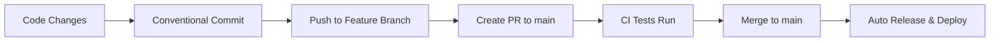

# 🚀 Deployment Guide - jell-utils

## 📋 Overview

This project uses a **modern automated CI/CD pipeline** with semantic versioning, conventional commits, and automatic NPM publishing.

### 🎯 Key Features

- ✅ **Automatic versioning** based on conventional commits
- ✅ **Semantic Release** with changelog generation
- ✅ **Multi-Node.js version testing** (18.x, 20.x, 21.x)
- ✅ **Cross-platform testing** (Ubuntu, Windows, macOS)
- ✅ **Security scanning** and vulnerability checks
- ✅ **Supply chain security** with provenance attestation
- ✅ **Automated NPM publishing** to registry
- ✅ **GitHub releases** with assets and notes
- ✅ **Slack notifications** (if configured)
- ✅ **Rollback capabilities** for failed releases

---

## 🔄 Workflow Overview

### 1. 📝 Development Workflow



### 2. 🤖 Automated Pipeline

1. **Quality Gate**: Builds, tests, and lints across multiple environments
2. **Security Audit**: Vulnerability scanning and dependency analysis
3. **Release Check**: Semantic analysis of commits for version calculation
4. **Automated Release**: Version bump, changelog, GitHub release, NPM publish
5. **Notifications**: Success/failure alerts via Slack and GitHub issues

---

## 🎨 Commit Message Format

This project uses **[Conventional Commits](https://conventionalcommits.org/)** specification.

### Format

```
<type>[optional scope]: <description>

[optional body]

[optional footer(s)]
```

### Supported Types

| Type       | Release        | Description             | Example                                |
| ---------- | -------------- | ----------------------- | -------------------------------------- |
| `feat`     | **minor**      | New feature             | `feat: add Korean text detection`      |
| `fix`      | **patch**      | Bug fix                 | `fix: resolve parseTime radix issue`   |
| `perf`     | **patch**      | Performance improvement | `perf: optimize toTitleCase algorithm` |
| `docs`     | **patch**      | Documentation changes   | `docs: update API documentation`       |
| `refactor` | **patch**      | Code refactoring        | `refactor: simplify isiOS function`    |
| `test`     | **no release** | Test additions          | `test: add parseNumber edge cases`     |
| `ci`       | **no release** | CI configuration        | `ci: update GitHub Actions workflow`   |
| `style`    | **no release** | Code formatting         | `style: fix indentation`               |

### Breaking Changes

Add `BREAKING CHANGE:` in footer or `!` after type for **major** version bump:

```
feat!: remove deprecated clone function

BREAKING CHANGE: clone function now requires explicit type parameter
```

### 🛠️ Easy Commit Tool

```bash
# Interactive commit message builder
npm run commit
```

---

## 🚦 Branch Strategy

### Main Branches

- **`main`/`master`**: Production-ready code, auto-deploys to NPM
- **`beta`**: Beta releases with `-beta` prerelease tag
- **`alpha`**: Alpha releases with `-alpha` prerelease tag

### Feature Development

1. Create feature branch from `main`
2. Make changes with conventional commits
3. Create PR to `main`
4. Auto-merge after CI passes

---

## ⚙️ Setup Instructions

### 1. 📦 Install Dependencies

```bash
npm install
```

### 2. 🎣 Initialize Git Hooks

```bash
npx husky install
```

### 3. 🔑 Configure Secrets (Repository Admin)

#### Required GitHub Secrets:

```bash
# NPM Publishing Token (https://npmjs.com/settings/tokens)
NPM_TOKEN=npm_xxxxxxxxxxxxxxxx

# Optional: Slack notifications
SLACK_WEBHOOK_URL=https://hooks.slack.com/services/...

# Optional: Code coverage
CODECOV_TOKEN=xxxxxxxx-xxxx-xxxx-xxxx-xxxxxxxxxxxx
```

#### Setting Secrets:

1. Go to repository **Settings** → **Secrets and variables** → **Actions**
2. Click **New repository secret**
3. Add each secret above

### 4. 📋 Branch Protection Rules

Configure branch protection for `main`:

1. **Settings** → **Branches** → **Add rule**
2. Branch name pattern: `main`
3. Enable:
   - ✅ Require a pull request before merging
   - ✅ Require status checks to pass before merging
   - ✅ Require up-to-date branches before merging
   - ✅ Include administrators

---

## 🎮 Usage Commands

### Development

```bash
# Build project
npm run build

# Run tests with coverage
npm run test:coverage

# Lint and fix code
npm run lint:fix

# Format code
npm run format

# Interactive commit (recommended)
npm run commit
```

### Release Management

```bash
# Test semantic release (dry run)
npm run semantic-release:dry-run

# Manual version bump (emergency only)
npm run release:patch  # x.x.X
npm run release:minor  # x.X.0
npm run release:major  # X.0.0
```

### CI Commands

```bash
# Full CI pipeline locally
npm run ci:install
npm run ci:build
npm run ci:test
npm run ci:lint
```

---

## 🔧 Configuration Files

### Core Configuration

- **`.releaserc.json`**: Semantic release configuration
- **`package.json`**: NPM scripts and dependencies
- **`.github/workflows/`**: GitHub Actions workflows

### Code Quality

- **`.husky/`**: Git hooks for commit validation
- **`commitlint.config.js`**: Commit message linting
- **`lint-staged`**: Pre-commit code formatting
- **`.eslintrc`**: Code linting rules

---

## 🚨 Troubleshooting

### Common Issues

#### 1. ❌ Commit Message Rejected

```bash
Error: Commit message does not follow Conventional Commits format
```

**Solution**: Use `npm run commit` or follow the format above.

#### 2. ❌ NPM Publish Failed

```bash
Error: 401 Unauthorized - PUT https://registry.npmjs.org/jell-utils
```

**Solution**: Check `NPM_TOKEN` in repository secrets.

#### 3. ❌ No Release Created

```bash
No new version is released
```

**Solution**: Ensure commits follow conventional format and have appropriate types.

#### 4. ❌ Tests Failing in CI

```bash
Tests are failing on multiple Node.js versions
```

**Solution**: Run tests locally on Node.js 18+ and fix compatibility issues.

### 🔄 Manual Recovery

#### Emergency Release

If automated release fails:

```bash
# 1. Create manual release
npm version patch  # or minor/major
git push origin main --tags

# 2. Publish to NPM
npm publish

# 3. Create GitHub release manually
```

#### Rollback Release

If release has issues:

```bash
# 1. Deprecate NPM version
npm deprecate jell-utils@X.X.X "Version withdrawn due to issues"

# 2. Revert git commits
git revert <commit-hash>
git push origin main
```

---

## 📊 Monitoring & Analytics

### Release Notifications

- ✅ **Slack alerts** for successful/failed releases
- ✅ **GitHub issues** created for failed deployments
- ✅ **Email notifications** via GitHub settings

### Package Analytics

- 📈 **NPM download stats**: https://npm-stat.com/charts.html?package=jell-utils
- 🔍 **Bundle size analysis**: Automated in CI pipeline
- 📊 **Test coverage reports**: Generated with each release

---

## 🤝 Contributing

### Quick Start for Contributors

1. Fork the repository
2. Create feature branch: `git checkout -b feat/amazing-feature`
3. Make changes with conventional commits
4. Push and create PR
5. Wait for CI to pass
6. Merge and automatic release!

### Commit Examples

```bash
# New feature
git commit -m "feat: add parseTime millisecond support"

# Bug fix
git commit -m "fix: handle null values in clone function"

# Documentation
git commit -m "docs: add deployment guide"

# Breaking change
git commit -m "feat!: remove deprecated API methods

BREAKING CHANGE: parseOldFormat() has been removed, use parseTime() instead"
```

---

## 🔗 Useful Links

- 📚 **[Conventional Commits](https://conventionalcommits.org/)**
- 📖 **[Semantic Release](https://semantic-release.gitbook.io/)**
- 🚀 **[GitHub Actions](https://docs.github.com/en/actions)**
- 📦 **[NPM Package](https://www.npmjs.com/package/jell-utils)**
- 🏠 **[Repository](https://github.com/jellive/jell-utils.js)**

---

## 🆘 Support

- 🐛 **Bug reports**: [Create GitHub Issue](https://github.com/jellive/jell-utils.js/issues/new?template=bug_report.md)
- 💡 **Feature requests**: [Create GitHub Issue](https://github.com/jellive/jell-utils.js/issues/new?template=feature_request.md)
- 💬 **Questions**: [GitHub Discussions](https://github.com/jellive/jell-utils.js/discussions)

_Last updated: $(date)_
